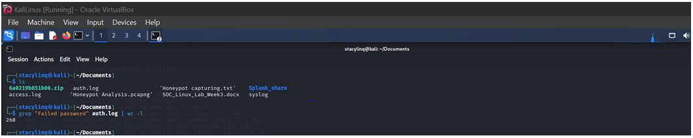
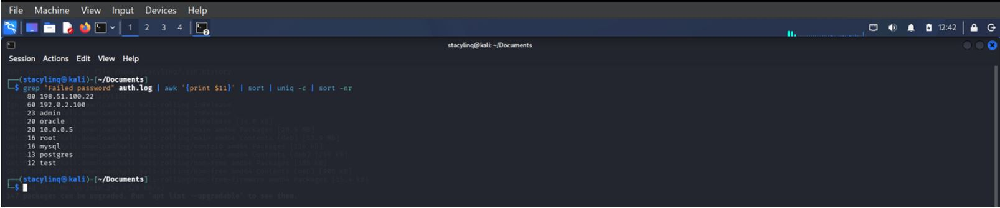
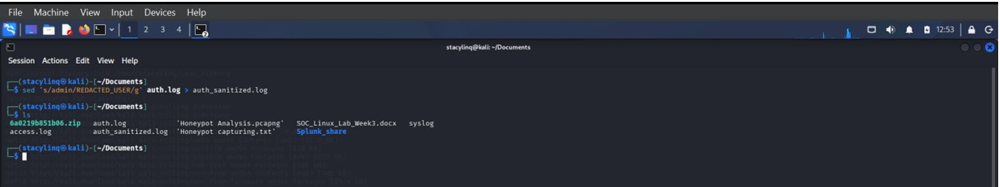
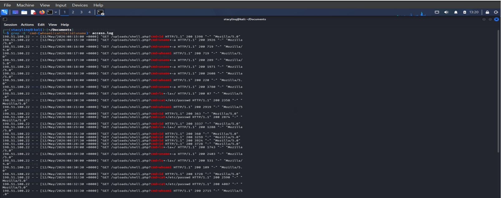
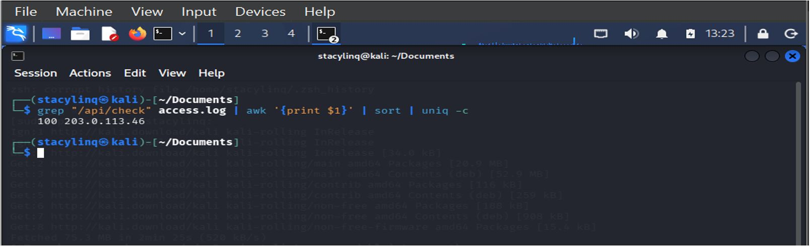
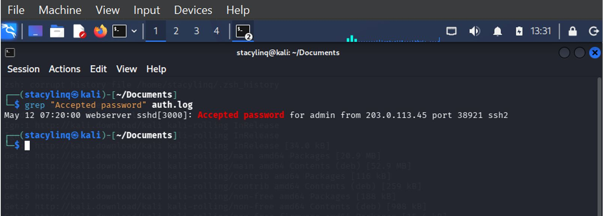
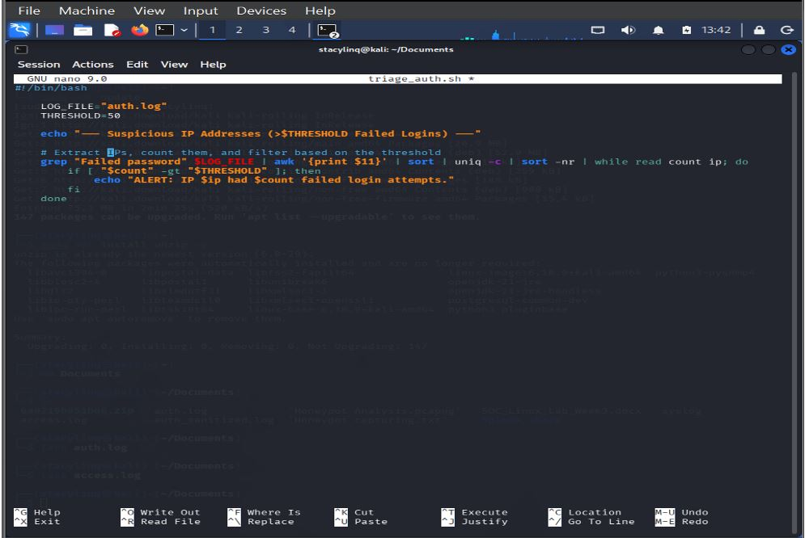
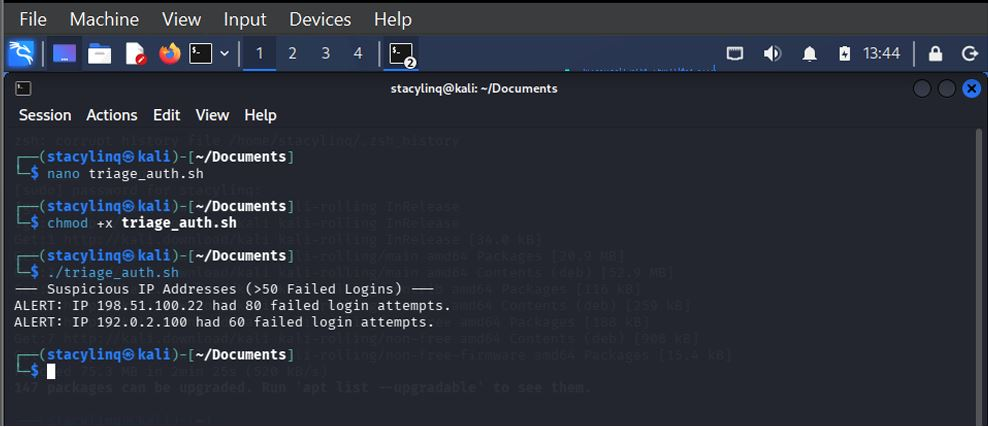

# Essential Linux & Command Line Skills for SOC Analysts

## Project Overview

This project simulates a real-world Security Operations Center (SOC) investigation environment where Linux-based systems and web server logs were analyzed to identify suspicious activities, potential cyberattacks, and indicators of compromise (IOCs).

Using Kali Linux and command-line analysis techniques, I investigated authentication logs, web server access logs, and system logs to detect brute-force attacks, command injection attempts, privilege escalation, and lateral movement activities.

---

## Project Details

| Category | Information |
|----------|-------------|
| Project Title | Essential Linux & Command Line Skills for SOC Analysts |
| Environment | Kali Linux Virtual Machine |
| Focus Area | Log Analysis, Threat Hunting, Incident Response |
| Log Sources | auth.log, access.log, syslog |
| Analyst | Ebere Anastasia Akpan |

---

## Objectives

- Develop practical Linux command-line skills for SOC operations.
- Perform log analysis and threat hunting using production-scale log files.
- Detect indicators of compromise (IOCs) and suspicious activities.
- Correlate events across multiple log sources.
- Automate security investigations using Bash scripting.
- Apply incident response techniques to investigate attacks.

---

## Tools & Technologies

### Operating System
- Kali Linux

### Linux Utilities
- grep
- awk
- sed
- sort
- wc
- chmod
- nano

### Security Concepts
- Log Analysis
- Event Correlation
- Threat Hunting
- Incident Response
- Privilege Escalation Detection
- Brute-Force Detection

### Scripting
- Bash

---

## Investigation Methodology

### Step 1: Authentication Log Analysis

Analyzed the `auth.log` file to identify:

- Failed SSH login attempts
- Successful logins
- Brute-force attack patterns
- Suspicious IP addresses

#### Command Used

```bash
grep "Failed password" auth.log | wc -l
```



#### Finding

A total of **260 failed login attempts** were identified, indicating possible brute-force activity targeting the server.

---

### Step 2: Identifying Top Attacking IP Addresses

Extracted source IP addresses responsible for failed authentication attempts.

#### Command Used

```bash
grep "Failed password" auth.log | awk '{print $11}' | sort | uniq -c | sort -nr
```



#### Finding

The IP address below generated the highest number of failed authentication attempts:

```text
198.51.100.22
```

Total Failed Attempts:

```text
80
```

This activity strongly suggested a brute-force attack.

---

### Step 3: Log Sanitization

Used `sed` to remove sensitive user information before sharing logs.

#### Command Used

```bash
sed 's/admin/REDACTED_USER/g' auth.log > auth_sanitized.log
```



#### Purpose

- Protect sensitive information
- Maintain compliance with security best practices
- Enable safe log sharing

---

### Step 4: Detecting Web Shell Activity

Analyzed web server logs for command injection attempts.

#### Command Used

```bash
grep -E 'cmd=(whoami|cat|ls|id|uname)' access.log
```



#### Findings

Detected execution attempts involving:

```text
whoami
id
uname
cat /etc/passwd
```

These activities indicated:

- Command Injection
- Web Shell Activity
- Remote Command Execution

---

### Step 5: Detecting Potential C2 Beaconing

Analyzed repeated requests to the same API endpoint.

#### Command Used

```bash
grep "/api/check" access.log | awk '{print $1}' | sort | uniq -c
```



#### Findings

IP Address:

```text
203.0.113.46
```

Generated:

```text
100 requests
```

to:

```text
/api/check
```

This behavior may indicate:

- C2 Beaconing
- Automated Scanning
- API Abuse
- Suspicious Network Activity

---

### Step 6: Event Correlation

Correlated failed and successful authentication events.

#### Command Used

```bash
grep "Accepted password" auth.log
```



#### Finding

Successful SSH login observed from:

```text
203.0.113.45
```

User Account:

```text
admin
```

This indicated a likely successful credential compromise following brute-force activity.

---

## SOC Automation

### Bash Triage Script

Developed a Bash script named:

```text
triage_auth.sh
```

to automatically identify IP addresses exceeding a failed login threshold.



### Script Functionality

- Extract failed login attempts
- Count occurrences by IP address
- Compare against threshold values
- Generate security alerts

### Execution

```bash
chmod +x triage_auth.sh
./triage_auth.sh
```



### Output

```text
ALERT: IP 198.51.100.22 had 80 failed login attempts.
ALERT: IP 192.0.2.100 had 60 failed login attempts.
```

---

## Incident Response Investigation

### Scenario 1: Initial Access

#### Question

Did the attacker access the web server before launching SSH brute-force attacks?

#### Finding

The attacker at:

```text
198.51.100.22
```

accessed the web application before initiating SSH attacks.

This suggests:

1. Initial reconnaissance
2. Web application targeting
3. Follow-up SSH brute-force activity

---

### Scenario 2: Privilege Escalation

#### Commands Used

```bash
grep "sudo" auth.log
```

```bash
grep "EXECVE" syslog | grep "sudo"
```

#### Findings

Evidence showed:

- Successful sudo execution
- Root shell access
- Elevated administrative activity

Examples observed:

```text
/bin/bash
systemctl
sudo
```

This confirmed successful privilege escalation following compromise.

---

### Scenario 3: Lateral Movement

#### Command Used

```bash
grep "10.0.0.5" auth.log
```

#### Findings

Detected repeated SSH login attempts originating from:

```text
10.0.0.5
```

This activity may indicate:

- Internal reconnaissance
- Lateral movement attempts
- Credential abuse

---

## Key Findings Summary

| Finding | Evidence |
|----------|----------|
| Brute Force Attack | 260 failed login attempts |
| Top Attacker IP | 198.51.100.22 |
| Command Injection | whoami, id, uname, cat /etc/passwd |
| Potential C2 Activity | 100 requests to /api/check |
| Successful Compromise | SSH login from 203.0.113.45 |
| Privilege Escalation | sudo and root shell execution |
| Lateral Movement | Activity from 10.0.0.5 |

---

## MITRE ATT&CK Mapping

| Tactic | Technique |
|----------|-----------|
| Credential Access | T1110 - Brute Force |
| Execution | T1059 - Command and Scripting Interpreter |
| Persistence | T1505.003 - Web Shell |
| Privilege Escalation | T1548 - Abuse Elevation Control Mechanism |
| Lateral Movement | T1021 - Remote Services |

---

## Recommendations

### Authentication Security

- Enforce strong password policies.
- Implement Multi-Factor Authentication (MFA).
- Disable password-based SSH authentication where possible.

### Network Security

- Restrict SSH access using IP whitelisting.
- Implement firewall controls.
- Monitor abnormal authentication activity.

### Monitoring & Detection

- Continuously review authentication logs.
- Monitor web server activity.
- Deploy centralized log management solutions.

### Security Awareness

- Conduct cybersecurity awareness training.
- Educate administrators on secure system practices.
- Establish incident response procedures.

---

## Skills Demonstrated

### SOC Operations

- Security Monitoring
- Threat Detection
- Incident Investigation
- Event Correlation
- Threat Hunting
- Incident Response

### Linux Administration

- Linux Command Line
- Log Management
- Bash Scripting
- User Activity Analysis

### Cybersecurity

- IOC Identification
- Brute-Force Detection
- Privilege Escalation Analysis
- Web Attack Investigation
- C2 Detection
- Lateral Movement Analysis

---

## Conclusion

This project strengthened my ability to investigate security incidents using Linux logs, detect attacker behavior through event correlation, analyze authentication and web server logs, identify indicators of compromise (IOCs), automate repetitive SOC tasks using Bash, and apply incident response methodologies in a practical SOC environment.
Overall, the lab provided hands-on exposure to SOC workflows and highlighted the importance of log analysis in detecting and responding to cyber threats in real-world environments.


